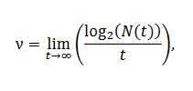
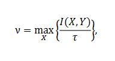
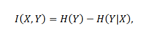
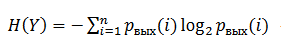
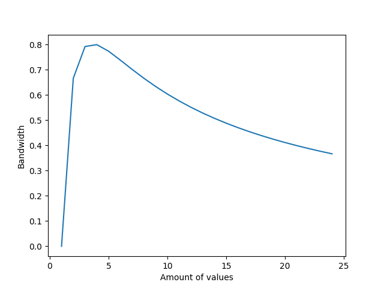

### Дан скрытый канал, передающий N символов. На передачу символа «i» требуется i  секунд (к примеру, на передачу символа «1» требуется 1 секунда, на передачу символа «2»  требуется 2 секунды, и так далее).

#### Вероятности входных  символов одинаковы и  равны 1 𝑁
#### Канал без ошибок (символы передаются с  вероятностью, равной 1)

1) Найти N, при котором пропускная способность скрытого канала будет максимальной.
Для канала без шума пропускная способность будет равна

Или

Где  

H(Y|X) = 0, так как канал без ошибок

H(Y) - энтропия случайной величины 

p(i) = 1/N (из условия)

T = (1 + 2 + 3 + ... + N) / N = (N+1)/2

Таким образом

v = 2*H(Y) / (N+1)

2) Построить график зависимости пропускной способности скрытого канала от N.

**Таким образом, максимальная пропускная способность 0.8 достигается при длине алфавита 4**